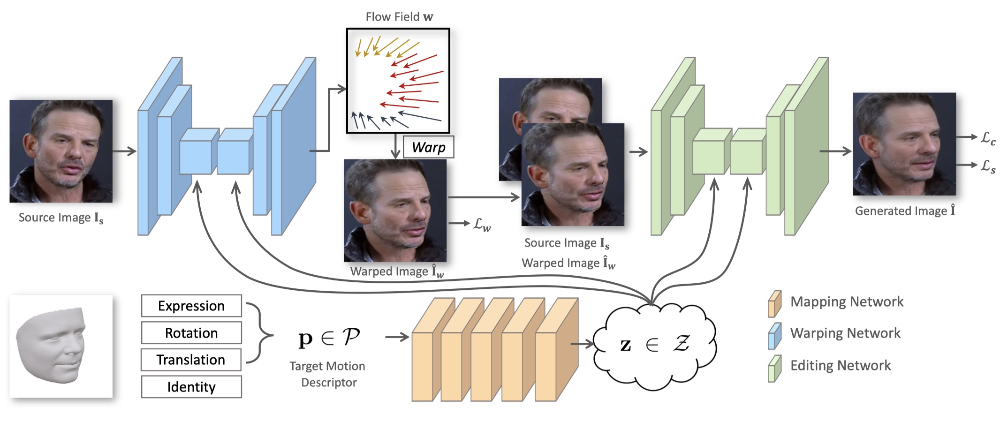

  
  

# **Abstract**
Generating portrait images by controlling the motions of existing faces is an important task of great consequence to social media industries. For easy use and intuitive control, semantically meaningful and fully disentangled parameters should be used as the modifications. 
However, many existing techniques do not provide such fine-grained controls or use indirect editing methods i.e. mimic motions of other individuals. 
In this paper, a **Portrait Image Neural Renderer** (PIRenderer) is proposed to control the face motions with the parameters of three-dimensional morphable face models (3DMMs). 
The proposed model can generate photo-realistic portrait images with accurate movements according to intuitive modifications. 
Experiments on both direct and indirect editing tasks demonstrate the superiority of this model. 
Meanwhile, we further extend this model to tackle the audio-driven facial reenactment task by extracting sequential motions from audio inputs. We show that our model can generate coherent videos with convincing movements from only a single reference image and a driving audio stream.

# **Network Architecture**
The proposed **PIRenderer** can synthesis portrait images by intuitively controlling the face motions with fully disentangled 3DMM parameters. The architecture of this network is shown below. 

### **The Mapping Network**

The mapping network is used to product latent vectors from the motion descriptors. 
The learned latent vectors are used to control the warping network and the editing network to synthesize images with accurate motions.

### **The Warping Network**

The warping network is used to estimate the motions between source images and target images.
It takes the source image  and the latent vector as inputs and generates the flow field containing the coordinate offsets specifying which positions in the sources could be sampled to generate the targets.

### **The Editing Network**

Although the warping network is efficient at spatially transforming the source images, it is limited by the inability to generate contents that do not exist in the sources. Meanwhile, artifacts introduced by the warping operation will lead to performance decline. Therefore, an editing network is designed to modify the warped coarse results and generate realistic target images.

<!-- 
The **Global-Flow Local-Attention** model is used to spatially transform the source image information at the feature level. A Global Flow Field Estimator is first employed to predict the flow fields between sources and targets. Then, a Local Neural Texture Renderer is used to to synthesize the final results using local attention.
 -->

<!-- The local attention blocks in the Local Neural Texture Renderer are responsible for transforming source information. The transformation process is shown below. For each target position, the corresponding local patch pair is first extracted. Then the local attention coefficients are predicted for content-aware sampling.

 -->
# **Results**

<iframe width="800" height="450" src="https://www.youtube.com/embed/gDhcRcPI1JU" frameborder="0" allow="accelerometer; autoplay; encrypted-media; gyroscope; picture-in-picture" allowfullscreen></iframe>

 

<!--  
### **Pose-Guided Person Image Generation**

  
  

  Form Left to Right: Source, Target Pose, Target Image, <a herf="https://arxiv.org/abs/1801.00055">DefGAN</a>, <a herf="https://arxiv.org/abs/1804.04694">VU-Net</a>, <a href="https://arxiv.org/abs/1904.03349">Pose-Attn</a>, <a href="http://mmlab.ie.cuhk.edu.hk/projects/pose-transfer/">Intr-Flow</a>, Ours.

 

### **Pose-Guided Person Image Animation**

  
  

<b>From Left to Right</b>: Real Video, Extracted Pose, Animation Results.

### **Face Image Animation**
Given a source face and a sequence of edge images, our model generates the result video with specific motions.

  
  

    <b> Left</b>: Input Source Image and Edge Sequence, Right: Animation results.

### **Novel View Synthesis**
View synthesis requires generating novel views of objects or scenes based on arbitrary input views. In this task, we generate multi-images with different view points based on a single input source image.

  
  

Form Left to Right: Source, Results of <a href="https://arxiv.org/abs/1605.03557">Appearance flow</a>, Ours, and Ground-truth images.

  -->